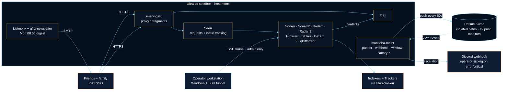
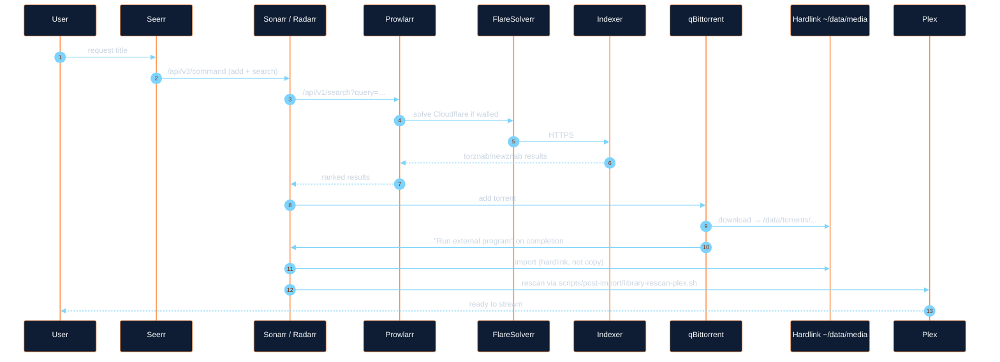
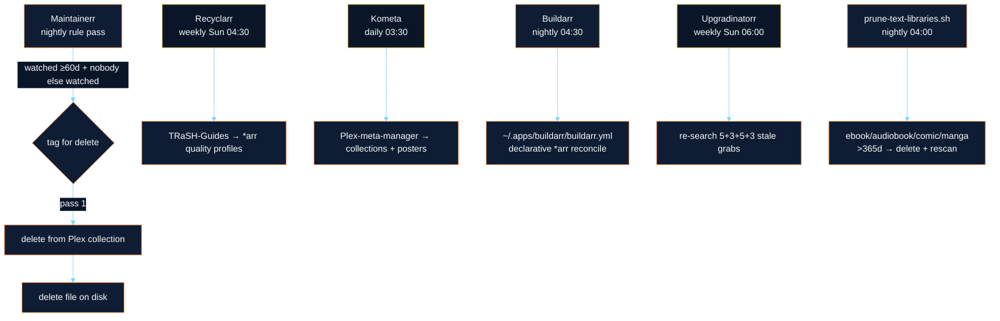
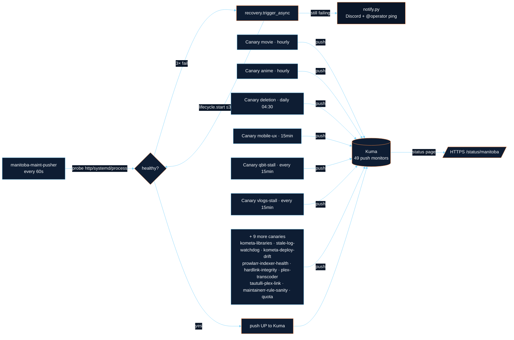
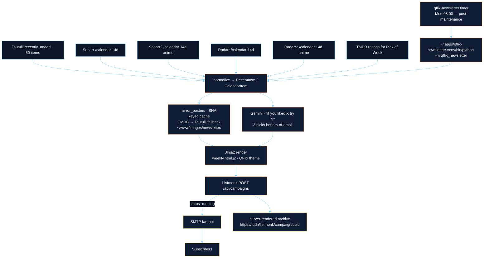
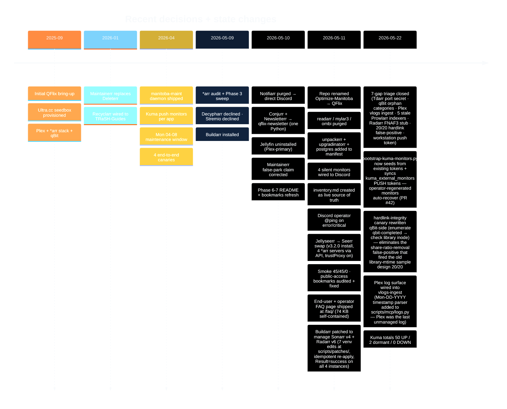

<div align="center">


# QFlix

**A reproducible, self-healing Plex stack on a single Ultra.cc shared seedbox.**

_One operator. One manifest. One maintenance window. Everything else is wires._

<p>
  <a href="scripts/smoke-test.sh"></a>
  <a href="manifest/apps.yaml"></a>
  <a href="#operator-visibility"></a>
  <a href="#required-apps"></a>
  <a href="#notification-channel"></a>
</p>

<sub>install scripts · single-source manifest · Python maintenance daemon · app-upgrade-all weekly sweep · Kuma-integrated auto-recovery · end-to-end canaries · weekly AI-curated newsletter</sub>

</div>

---

<p align="center">
  <a href="#at-a-glance">At a glance</a> ·
  <a href="#required-apps">Required apps</a> ·
  <a href="#architecture">Architecture</a> ·
  <a href="#project-timeline">Timeline</a> ·
  <a href="#manifest--single-source-of-truth">Manifest</a> ·
  <a href="#repo-layout">Repo layout</a> ·
  <a href="#how-its-run">How it's run</a> ·
  <a href="#where-to-dig-in">Dig in</a>
</p>

---

## At a glance

| Surface | Count | State |
|---|---:|---|
| Apps in manifest (`manifest/apps.yaml`) | **33** | 19 UCC · 5 systemd · 8 cron · 1 library |
| End-to-end canaries (`manifest/apps.yaml` `canaries:`) | **15** | movie · anime · deletion · mobile-ux · qbit-stall · vlogs-stall · kometa-libraries · stale-log-watchdog · kometa-deploy-drift · prowlarr-indexer-health · hardlink-integrity · plex-transcoder · tautulli-plex-link · maintainerr-rule-sanity · quota |
| Kuma push monitors (manitoba-owned) | **49** | 49/49 UP — every manifest app + all 15 canaries + the daemon's self-heartbeat report continuously. Plus 4 external (3 Quadstronix nodes + 1 workstation collector); external PUSH tokens self-heal across `bootstrap-kuma-monitors.py` runs as of 2026-05-22. |
| Cron + systemd timers | **14+** | window-aware (Mon 11–15 UTC drain) |
| pytest suite (`tests/unit/`) | **440+** | pure-Python, no SSH |
| Notification channels | **1** | Discord webhook + operator @ping on error/critical |

> [!NOTE]
> The string `seedbox.example.com` is the **sanitized** form for the public repo. Operator-local clones substitute the real FQDN from `secrets/seedbox.host` (and `secrets/seedbox.ssh-host` when the SSH host differs from the public HTTPS host — typical on shared Ultra.cc where SSH lands on the shared box but HTTPS lands on the operator slot).

---

## Required apps

The kickoff defines a non-negotiable core. Every other app exists to feed, observe, or serve it.

| Role | App | Why it's load-bearing |
|---|---|---|
| 🟠 Media server | **Plex** | Canonical (Jellyfin trial concluded 2026-05-10; Plex is the only library users see) |
| 🟠 User requests | **Seerr** | The user-facing front door — "I want X" + in-item issue reporting |
| 🟠 Indexers | **Prowlarr** | Single aggregator; *arr stack reads from here, not raw indexers |
| 🟠 TV | **Sonarr** + **Sonarr2** (anime branch) | One per release-naming convention |
| 🟠 Movies | **Radarr** + **Radarr2** (anime branch) | Same split |
| 🟠 Subtitles | **Bazarr** + **Bazarr 2** (anime branch) | One per arr-pair — Bazarr is hard-capped at one Sonarr + one Radarr each, so the second anime instance is a bare-Python install pinned to Bazarr-1's version (`bazarr2-sync.timer`) |
| 🟠 Retention | **Maintainerr** | 60-day "watched + nobody else cared" deletion engine |

Surrounding cast (qBittorrent, FlareSolverr, Tautulli, Tdarr, Listmonk, qflix-newsletter, Buildarr, Recyclarr, Kometa, Homarr, Kuma, manitoba-maint, 13 canaries, python-plexapi venv, postgres, unpackerr, upgradinatorr): same single-source-of-truth manifest, same maintenance window. Full breakdown in [`inventory.md`](inventory.md).

---

## Architecture

### High level



> [!IMPORTANT]
> The "isolated netns" detail matters: Kuma cannot reach the host's loopback. That's why **pusher pushes status TO Kuma** and **auto-heal fires from the pusher itself** (not from a Kuma webhook), once it sees three consecutive failed probes.

### Four data flows

<details><summary><b>1. Media ingestion</b> — "I want to watch X"</summary>



Hardlinks are sacred — *arrs hardlink, never copy. `scripts/smoke-test.sh` step 5 spot-checks linkcount ≥ 2 on a sample of Movies.

</details>

<details><summary><b>2. Library hygiene</b> — "I want my disk back"</summary>



Recyclarr, Kometa, Buildarr, and Upgradinatorr are cron-class — no UI, just systemd timers firing oneshot services.

</details>

<details id="operator-visibility"><summary><b>3. Operator visibility</b> — "is anything on fire?"</summary>



Each canary asserts a whole pipeline, not just liveness. Mobile-UX renders the public Homarr board and checks HTML size + the `/` → board redirect. Levels `error` and `critical` add the operator user-id from `secrets/discord-operator.id` as a `<@id>` mention in the Discord payload so the operator gets a push notification, not just an embed.

> [!NOTE]
> **Coverage is comprehensive** as of 2026-05-11 — every app in `manifest/apps.yaml` has a Kuma push monitor and reports continuously. `health.py` supports six probe kinds: `http_api`, `http_root` (both with optional `hostname` override for Docker-bridge-only services), `systemd_only`, `port_listen`, `import_check` (tilde-expanded), and `process_pattern` (pgrep-backed for raw processes like `unpackerr` and the Postgres `checkpointer` subprocess).

</details>

<details><summary><b>4. Subscriber comms</b> — Monday-morning AI-curated digest</summary>



Email sections: **Pick of Week → New Movies → New TV → New Anime → Coming Soon → AI Picks → Nerd Corner.** Failure modes are isolated — if Gemini rate-limits, the AI section just goes silent; the rest of the email still ships. Posters are mirrored to `~/www/images/newsletter/<sha>.<ext>` at render time so delivered mail survives upstream TMDB CDN rot; cache is pruned daily by `qflix-poster-cache-prune.timer` (30-day retention). See `scripts/qflix-newsletter/qflix_newsletter/main.py` and `posters.py`.

</details>

---

## Project timeline



---

## Manifest — single source of truth

> [!IMPORTANT]
> `manifest/apps.yaml` is the **only** place that records "what apps exist." Health probes, systemd units, Kuma monitors, recovery, and the weekly upgrader all read from here.

<details><summary>Schema</summary>

```yaml
defaults:
  health_timeout_s: 5
  recovery_attempts: 3
  recovery_backoff_s: [10, 30, 60]
  lifecycle_timeout_s: 60
  kuma_recheck_delay_s: 90

kuma_external_monitors:        # other-project monitors in the shared Kuma — excluded from "all up"
  - "Quadstronix"
  - "Quadstronix Node 1"
  - "Quadstronix Node 2"

apps:
  sonarr:
    class: ucc                  # ucc | systemd | cron | library
    ucc_slug: sonarr
    kuma_monitor: "Sonarr"      # null = no Kuma monitor (still in manifest)
    parked: false               # true = pusher skips auto-heal
    health:
      kind: http_api            # http_api | http_root | systemd_only | process_pattern | import_check
      path_template: "/{urlbase}/api/v3/system/status"
      auth_header: "X-Api-Key"
      auth_secret: sonarr.key
      port_secret: sonarr.port
      urlbase_secret: sonarr.urlbase
      expect_status: 200
    upgrade:                    # optional
      kind: tarball_swap        # tarball_swap | zip_swap | pip_install | git_checkout
      url_template: "..."
      target_path: "..."
      version_pin:              # optional cap
        source: versions.env
        key: SONARR_VERSION
        max: "4.0.x"
        max_reason: "GLIBC blocker"
```

</details>

<details><summary>Class semantics</summary>

| Class | Started via | Stopped via | Typical example |
|---|---|---|---|
| `ucc` | `app-<slug> start` (UCC wrapper) | `app-<slug> stop` | sonarr, seerr, plex |
| `systemd` | `systemctl --user start <unit>` | matching `stop` | listmonk, tdarr-server |
| `cron` | timer fires service (oneshot) | n/a — fires + exits | recyclarr, buildarr, qflix-newsletter |
| `library` | n/a — no service | n/a | python-plexapi |

The pusher dispatches on `class` for both lifecycle ops and probe selection.

</details>

---

## Repo layout

```text
manifest/apps.yaml           # 33 apps + 15 canaries — single source of truth
versions.env                 # pinned versions (Tdarr only — pin policy lifted 2026-05-09)
inventory.md                 # live snapshot of every artifact on the seedbox
Tuesday.md                   # design doc — extending Mon window to systemd apps

docs/
  internal-app-tunnels.md    # public/internal split + ssh -L command per INTERNAL app
  secrets-convention.md      # ~/secrets/ inventory + filename rules
  operator-deferred.md       # manual steps that can't be scripted yet
  transition-log.md          # reversible state-changes log
  arr-audit-*.md             # *arr stack audits + punch-lists
  external/ultracc-reference.md
  superpowers/               # plan + spec docs (longer-form designs)

scripts/
  bootstrap-discover.sh      # fresh-seedbox discovery
  manitoba-tunnel.ps1        # workstation SSH tunnel daemon (gitignored — hardcodes FQDN)
  local-llm/                 # workstation local-LLM helpers (qflix-rea.ps1 — gitignored)
  local/                     # workstation daemons + MCP server
    qflix-collect.ps1        # hourly seedbox snapshot → B:\QFlix\data\
    install-qflix-collect.ps1
    qflix-mcp/               # stdio MCP server (qflix_query_logs + 13 more tools)
  mcp/                       # seedbox-side helpers invoked over SSH
    collect.py · logs.py · unstick.py · missing.py · plex.py
  smoke-test.sh              # production smoke (~51 checks across the whole stack)
  smoke-test-plex.sh         # Plex-ecosystem-only smoke
  qflix-top.sh               # htop-style CPU/RAM viewer — your components vs other tenants
  canaries/                  # 9 end-to-end pipeline checks (bash)
  configure/                 # phased install/configure scripts (numbered)
  install/                   # lower-level installer libs
  lib/                       # shared bash helpers
  data/                      # static config: kuma-qflix*.css, prowlarr indexer JSON
  ops/                       # cron-friendly heartbeats per long-running app
  plex/                      # kill_stream, stream_stats
  post-import/               # *arr post-import callbacks
  smoke/                     # arr-audit + arr-audit-fixes
  qflix-newsletter/          # Mon-08:00 weekly digest Python package
  maint/                     # the maintenance daemon
    manitoba-maint           # CLI entrypoint
    app-upgrade-all.sh       # weekly `app-<name> upgrade` sweep
    arr-housekeeping.py      # daily Find-Missing + hourly stuck-queue unstick
    lib/                     # manifest · health · lifecycle · recovery
                             # kuma · pusher · window · notify · state · cli · qbit
    systemd/                 # 8 services + 8 timers → ~/.config/systemd/user/

secrets/                     # gitignored — per-secret one-line files
tests/                       # 440+ pytest tests (unit/) — pure-Python, no SSH
```

---

## How it's run

QFlix runs unattended most of the week. The things worth knowing if you're reading the code or wondering how the lights stay on:

<a id="notification-channel"></a>

- **Maintenance window — Mon 11:00–15:00 UTC.** The only time the stack is allowed to break itself. Recyclarr syncs TRaSH-Guides, Kometa rebuilds collections, Buildarr reconciles *arr config, and `app-upgrade-all.sh` runs `app-<name> upgrade` for every UCC-managed app sequentially (replaces the prior Playwright clicker on cp.ultra.cc as of 2026-05-13). Auto-heal is paused for the duration so restarts don't race the upgrades. → [FAQ §8](https://quadstronaut.seedbox.example.com/faq/#sec-window)
- **Self-heal loop.** Outside the window, a pusher probes every app every 60 s and pushes status to Uptime Kuma. After 3 consecutive failures it tries up to 3 restarts (10 s · 30 s · 60 s back-off) before paging on Discord. Most outages resolve inside 2 minutes without the operator touching anything. → [FAQ §10](https://quadstronaut.seedbox.example.com/faq/#sec-monitoring)
- **One alert channel.** A single Discord webhook with an operator `@ping` on `error` / `critical` levels (Notifiarr was retired 2026-05-10). → [FAQ §15](https://quadstronaut.seedbox.example.com/faq/#sec-discord)
- **Smoke test.** `scripts/smoke-test.sh` runs ~51 assertions across Prowlarr, *arr↔qBit, hardlinks, app liveness, and the maintenance system. Run after every tracked change. → [FAQ — what does smoke cover](https://quadstronaut.seedbox.example.com/faq/#q-smoke-buckets)
- **Resource viewer.** `scripts/qflix-top.sh` is an htop-style live view of how much CPU/RAM each QFlix component is using — in ratio to each other **and** to the rest of the shared Ultra.cc box. Runs unprivileged and `hidepid`-safe: "other tenants" is derived as box-total-minus-yours from `/proc/stat` + `/proc/meminfo`, never by snooping foreign processes. Processes are grouped by cgroup, so Plex's server + transcoder + plugins collapse into one line and sonarr/sonarr2 stay distinct. Your share is reported three ways — % of in-use CPU, whole-core equivalent, and % of all 128 cores — so the numbers reconcile instead of fighting each other. `--view app|role|both`, live keys `[a]/[r]/[b]/[+]/[-]/[q]`, or `--once` for a pipe-friendly snapshot. Lives in your seedbox `$HOME`.
- **QFlix Random Error Audit (REA).** Workstation-side second-opinion audit (`scripts/local-llm/qflix-rea.ps1` — gitignored; Task Scheduler at `\Archangel\QFlix-LLM\QFlix Random Error Audit`, AtLogOn trigger). On every Windows logon, after the SSH tunnel is up, it pulls 7 seedbox log surfaces (*arr logs, systemd journal errors, cron mail spool, maint pipeline, nginx errors, Plex errors, Kuma red-state) in **one SSH call**, then hands the consolidated blob to every code-capable Ollama model installed locally (auto-discovered via regex — `qwen3-coder:30b`, `qwen2.5-coder:7b`, `qwen3:8b` today). Models run sequentially; verdicts collapse by signature into one Discord message with the operator @ping if anything looks wrong, or a daily "✓ clean" heartbeat if nothing does. If Ollama itself is unreachable, a separate dead-man Discord alert fires (24h dedupe). Spec: [`docs/superpowers/specs/2026-05-11-qflix-rea-design.md`](docs/superpowers/specs/2026-05-11-qflix-rea-design.md). Install: `scripts/local-llm/qflix-rea.ps1 -Install`. Not wired into Kuma — purely local set of eyes.
- **Log aggregation — VictoriaLogs on the seedbox.** Single Linux binary at `~/.apps/vlogs/bin/victoria-logs-prod`, storing 90 d of every managed app's logs at `~/.apps/vlogs/data/` (<512 MB RAM, indexed). Three user-systemd units: `victorialogs.service` (long-running server, bound loopback-only on `secrets/vlogs.port`), `qflix-vlogs-ingest.timer` (every 5 min, imports `scripts/mcp/logs.py` in-process and POSTs JSON-lines to `127.0.0.1:<vlogs.port>/insert/jsonline`), and `manitoba-maint-canary-vlogs-stall.timer` (every 15 min, detects server down or zero-ingest stalls). The MCP server (`scripts/local/qflix-mcp/qflix_mcp.py`) exposes two reads: `qflix_get_logs` (live SSH pull, narrow window) and `qflix_query_logs` (LogsQL against the persistent index via SSH-exec'd curl — e.g. `level:Error AND app:radarr`). Install: `scripts/configure/80-vlogs-install.sh`. Kuma monitors: `VictoriaLogs`, `Qflix VLogs Ingest`, `Canary VLogs Stall`. UI from workstation: `ssh -L $PORT:127.0.0.1:$PORT $SEEDBOX -N`, then `http://127.0.0.1:$PORT/select/vmui/`. Moved off the workstation 2026-05-14 to satisfy the autonomy mandate (workstation off ≠ logs lost).

### What's reachable without the SSH tunnel

| Surface | URL | Auth |
|---|---|---|
| Plex | `https://<fqdn>/web/` | Plex SSO |
| Seerr (requests) | `https://<fqdn>/seerr/` | Plex SSO |
| FAQ + tutorial | `https://<fqdn>/faq/` | none |
| Homarr (public board) | `https://<fqdn>/` | none |
| Tautulli (read-only stats) | `https://<fqdn>/tautulli/` | none |
| Audiobookshelf | `https://audiobookshelf-<user>.<domain>/` | htpasswd |
| Calibre-Web · Kavita · Komga · Listmonk archive | `https://<fqdn>/<slug>/` | per-app login or none |
| Kuma status page | `https://<fqdn>/status/manitoba` | none |

Every *arr admin UI, Kuma admin, Listmonk admin, and qBittorrent live behind a workstation SSH tunnel and never touch the public surface. → [FAQ §7 for the tunnel setup](https://quadstronaut.seedbox.example.com/faq/#sec-tunnel)

---

## Where to dig in

- **End-user + contributor FAQ** → [quadstronaut.seedbox.example.com/faq/](https://quadstronaut.seedbox.example.com/faq/) — 18 sections, 70 Q&As. Covers requesting media, anime routing, why things disappear, the maintenance window, hardlinks, the top 10 recurring screw-ups, an emergency playbook, and a Nerd Corner that walks through every technology QFlix is built on. Source lives in [`scripts/data/qflix-faq.html`](scripts/data/qflix-faq.html).
- **What's installed where on the seedbox?** → [`inventory.md`](inventory.md) — the live source of truth, kept in sync with the manifest.
- **What apps exist?** → [`manifest/apps.yaml`](manifest/apps.yaml) — the single source of truth for health probes, monitors, recovery, and the upgrader.
- **Public status page** → [Uptime Kuma](https://uptimekuma-quadstronaut.seedbox.example.com/status/public) — every monitor, no login. User-facing incident notices are posted here.
- **Incident log** → [`docs/incidents.md`](docs/incidents.md) — operator-facing technical record of outages; the source of truth behind the status-page incidents.

## Local development

QFlix is a one-operator project, but the test suite is set up so a
contributor can run it from a fresh clone:

```bash
git clone https://github.com/Quadstronaut/QFlix.git && cd QFlix
bash tests/run.sh        # creates tests/.venv, installs pytest/pyyaml/requests/jinja2,
                         # runs tests/unit/ — pure-Python, no SSH needed.
```

Live integration (smoke tests, canaries, anything under `scripts/install/`
and `scripts/configure/`) requires a populated `secrets/` directory —
see [`docs/secrets-convention.md`](docs/secrets-convention.md) for the
canonical file list. `scripts/bootstrap-discover.sh` SSHes into a live
seedbox and populates the local `secrets/` from existing app configs.

The MCP server (`scripts/local/qflix-mcp/`) is a separate workstation-side
piece — register it with Claude Code via
`scripts/local/qflix-mcp/install.ps1`. Build context: `docs/superpowers/specs/2026-05-12-qflix-mcp-design.md`.

<div align="center">
<sub><br><br><b>QFlix</b> · single operator · single manifest · single window<br><sub><code>quadstronaut.seedbox.example.com</code></sub></sub>
</div>
