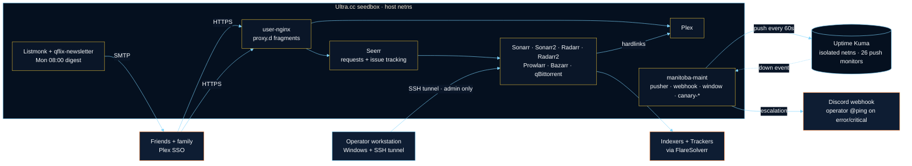
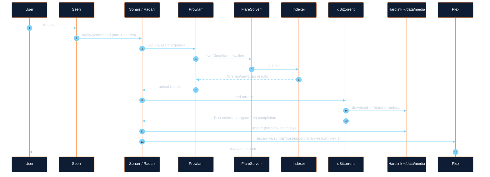
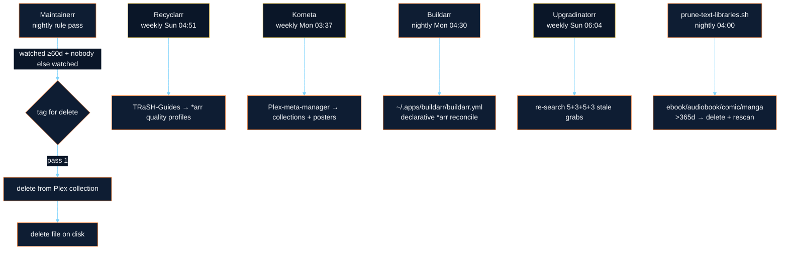
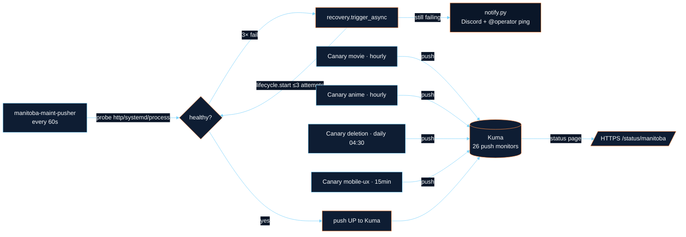
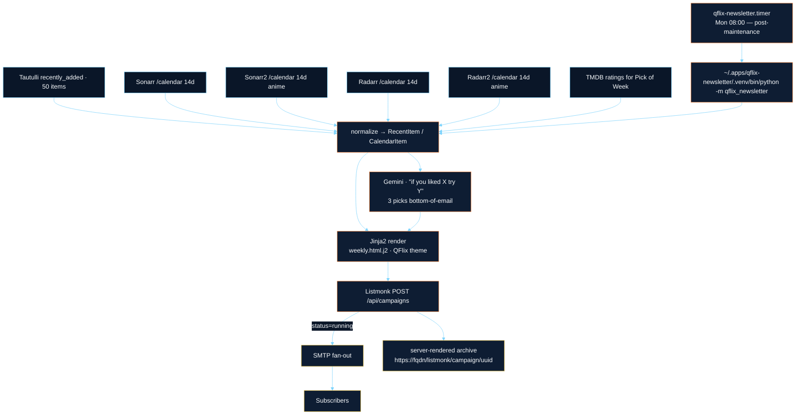
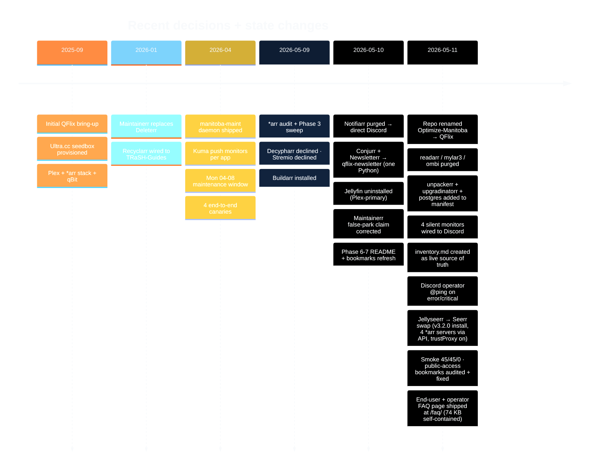

<div align="center">


# QFlix

**A reproducible, self-healing Plex stack on a single Ultra.cc shared seedbox.**

_One operator. One manifest. One maintenance window. Everything else is wires._

<p>
  <a href="scripts/smoke-test.sh"></a>
  <a href="manifest/apps.yaml"></a>
  <a href="#operator-visibility"></a>
  <a href="#required-apps"></a>
  <a href="#notification-channel"></a>
</p>

<sub>install scripts · single-source manifest · Python maintenance daemon · Playwright cp.ultra.cc upgrade clicker · Kuma-integrated auto-recovery · end-to-end canaries · weekly AI-curated newsletter</sub>

</div>

---

<p align="center">
  <a href="#at-a-glance">At a glance</a> ·
  <a href="#required-apps">Required apps</a> ·
  <a href="#architecture">Architecture</a> ·
  <a href="#project-timeline">Timeline</a> ·
  <a href="#manifest--single-source-of-truth">Manifest</a> ·
  <a href="#repo-layout">Repo layout</a> ·
  <a href="#operating-the-stack">Operating</a> ·
  <a href="#pointers">Pointers</a>
</p>

---

## At a glance

| Surface | Count | State |
|---|---:|---|
| Apps in manifest (`manifest/apps.yaml`) | **28** | live on `quadstronaut.seedbox.example.com` |
| End-to-end canaries (`scripts/canaries/`) | **4** | hourly · hourly · every-15min · daily-0430 |
| Kuma push monitors (manitoba-owned) | **32** | 32/32 UP after the 2026-05-11 coverage sweep (every manifest app reports) |
| Cron + systemd timers | **14** | window-aware (Mon 04–08 UTC drain) |
| pytest suite (`tests/unit/`) | **202** | pure-Python, no SSH |
| Notification channels | **1** | Discord webhook + operator @ping on error/critical |

> [!NOTE]
> The string `seedbox.example.com` is the **sanitized** form for the public repo. Operator-local clones substitute the real FQDN from `secrets/seedbox.host` (and `secrets/seedbox.ssh-host` when the SSH host differs from the public HTTPS host — typical on shared Ultra.cc where SSH lands on the shared box but HTTPS lands on the operator slot).

---

## Required apps

The kickoff defines a non-negotiable core. Every other app exists to feed, observe, or serve it.

| Role | App | Why it's load-bearing |
|---|---|---|
| 🟠 Media server | **Plex** | Canonical (Jellyfin trial concluded 2026-05-10; Plex is the only library users see) |
| 🟠 User requests | **Seerr** | The user-facing front door — "I want X" + in-item issue reporting |
| 🟠 Indexers | **Prowlarr** | Single aggregator; *arr stack reads from here, not raw indexers |
| 🟠 TV | **Sonarr** + **Sonarr2** (anime branch) | One per release-naming convention |
| 🟠 Movies | **Radarr** + **Radarr2** (anime branch) | Same split |
| 🟠 Retention | **Maintainerr** | 60-day "watched + nobody else cared" deletion engine |

Surrounding cast (Bazarr, qBittorrent, FlareSolverr, Tautulli, Tdarr, Listmonk, qflix-newsletter, Buildarr, Recyclarr, Kometa, Homarr, Kuma, manitoba-maint, 4 canaries, python-plexapi venv, postgres, unpackerr, upgradinatorr): same single-source-of-truth manifest, same maintenance window. Full breakdown in [`inventory.md`](inventory.md).

---

## Architecture

### High level



> [!IMPORTANT]
> The "isolated netns" detail matters: Kuma cannot reach the host's loopback. That's why **pusher pushes status TO Kuma** and **auto-heal fires from the pusher itself** (not from a Kuma webhook), once it sees three consecutive failed probes.

### Four data flows

<details><summary><b>1. Media ingestion</b> — "I want to watch X"</summary>



Hardlinks are sacred — *arrs hardlink, never copy. `scripts/smoke-test.sh` step 5 spot-checks linkcount ≥ 2 on a sample of Movies.

</details>

<details><summary><b>2. Library hygiene</b> — "I want my disk back"</summary>



Recyclarr, Kometa, Buildarr, and Upgradinatorr are cron-class — no UI, observe via `journalctl --user -u <name>.service`.

</details>

<details id="operator-visibility"><summary><b>3. Operator visibility</b> — "is anything on fire?"</summary>



Each canary asserts a whole pipeline, not just liveness. Mobile-UX renders the public Homarr board and checks HTML size + the `/` → board redirect. Levels `error` and `critical` add `<@REDACTED>` to the Discord payload so the operator gets a push notification, not just an embed.

> [!NOTE]
> **Coverage is comprehensive** as of 2026-05-11 — every app in `manifest/apps.yaml` has a Kuma push monitor and reports continuously. `health.py` supports six probe kinds: `http_api`, `http_root` (both with optional `hostname` override for Docker-bridge-only services), `systemd_only`, `port_listen`, `import_check` (tilde-expanded), and `process_pattern` (pgrep-backed for raw processes like `unpackerr` and the Postgres `checkpointer` subprocess).

</details>

<details><summary><b>4. Subscriber comms</b> — Monday-morning AI-curated digest</summary>



Email sections: **Pick of Week → New Movies → New TV → New Anime → Coming Soon → AI Picks → Nerd Corner.** Failure modes are isolated — if Gemini rate-limits, the AI section just goes silent; the rest of the email still ships. See `scripts/qflix-newsletter/qflix_newsletter/main.py`.

</details>

---

## Project timeline



---

## Manifest — single source of truth

> [!IMPORTANT]
> `manifest/apps.yaml` is the **only** place that records "what apps exist." Health probes, systemd units, Kuma monitors, recovery, upgrade — all read from here. If you change a port, change it in `secrets/` and the pusher picks it up; if you add an app, add a manifest entry and `~/bin/manitoba-maint kuma audit` will tell you whether the Kuma monitor needs creating.

<details><summary>Schema</summary>

```yaml
defaults:
  health_timeout_s: 5
  recovery_attempts: 3
  recovery_backoff_s: [10, 30, 60]
  lifecycle_timeout_s: 60
  kuma_recheck_delay_s: 90

kuma_external_monitors:        # other-project monitors in the shared Kuma — excluded from "all up"
  - "Quadstronix"
  - "Quadstronix Node 1"
  - "Quadstronix Node 2"

apps:
  sonarr:
    class: ucc                  # ucc | systemd | cron | library
    ucc_slug: sonarr
    kuma_monitor: "Sonarr"      # null = no Kuma monitor (still in manifest)
    parked: false               # true = pusher skips auto-heal
    health:
      kind: http_api            # http_api | http_root | systemd_only | process_pattern | import_check
      path_template: "/{urlbase}/api/v3/system/status"
      auth_header: "X-Api-Key"
      auth_secret: sonarr.key
      port_secret: sonarr.port
      urlbase_secret: sonarr.urlbase
      expect_status: 200
    upgrade:                    # optional
      kind: tarball_swap        # tarball_swap | zip_swap | pip_install | git_checkout
      url_template: "..."
      target_path: "..."
      version_pin:              # optional cap
        source: versions.env
        key: SONARR_VERSION
        max: "4.0.x"
        max_reason: "GLIBC blocker"
```

</details>

<details><summary>Class semantics</summary>

| Class | Started via | Stopped via | Typical example |
|---|---|---|---|
| `ucc` | `app-<slug> start` (UCC wrapper) | `app-<slug> stop` | sonarr, seerr, plex |
| `systemd` | `systemctl --user start <unit>` | matching `stop` | listmonk, tdarr-server |
| `cron` | timer fires service (oneshot) | n/a — fires + exits | recyclarr, buildarr, qflix-newsletter |
| `library` | n/a — no service | n/a | python-plexapi |

The pusher dispatches on `class` for both lifecycle ops and probe selection.

</details>

---

## Repo layout

```text
manifest/apps.yaml           # 28 apps + 4 canaries — single source of truth
versions.env                 # pinned versions (Tdarr only — pin policy lifted 2026-05-09)
inventory.md                 # live snapshot of every artifact on the seedbox
Tuesday.md                   # design doc — extending Mon window to systemd apps

docs/
  internal-app-tunnels.md    # public/internal split + ssh -L command per INTERNAL app
  secrets-convention.md      # ~/secrets/ inventory + filename rules
  operator-deferred.md       # manual steps that can't be scripted yet
  transition-log.md          # reversible state-changes log
  arr-audit-*.md             # *arr stack audits + punch-lists
  external/ultracc-reference.md
  superpowers/               # plan + spec docs (longer-form designs)

scripts/
  bootstrap-discover.sh      # fresh-seedbox discovery
  manitoba-tunnel.ps1        # workstation SSH tunnel daemon (gitignored — hardcodes FQDN)
  smoke-test.sh              # production smoke (~45 checks across the whole stack)
  smoke-test-plex.sh         # Plex-ecosystem-only smoke
  canaries/                  # 4 end-to-end pipeline checks (bash)
  configure/                 # phased install/configure scripts (numbered)
  install/                   # lower-level installer libs
  lib/                       # shared bash helpers
  data/                      # static config: kuma-qflix*.css, prowlarr indexer JSON
  ops/                       # cron-friendly heartbeats per long-running app
  plex/                      # kill_stream, stream_stats
  post-import/               # *arr post-import callbacks
  smoke/                     # arr-audit + arr-audit-fixes
  qflix-newsletter/          # Mon-08:00 weekly digest Python package
  maint/                     # the maintenance daemon
    manitoba-maint           # CLI entrypoint
    cp_upgrade_clicker.py    # Playwright/Firefox Upgrade & Repair sweep
    arr-housekeeping.py      # daily Find-Missing + hourly stuck-queue unstick
    lib/                     # manifest · health · lifecycle · recovery
                             # kuma · pusher · window · notify · state · cli · qbit
    systemd/                 # 8 services + 8 timers → ~/.config/systemd/user/

secrets/                     # gitignored — per-secret one-line files
tests/                       # 202 pytest tests (unit/) — pure-Python, no SSH
```

---

## Operating the stack

<details><summary>Maintenance window — Mon 04:00–08:00 UTC</summary>

`manitoba-maint-window.timer` fires `window.service` Monday 11:00 CEST (04:00 UTC). The service:

1. Posts a "window open" message to Discord.
2. Acquires `~/.opt/maint/window.lock` (the watchdog at 17:00 clears stale locks).
3. Runs Recyclarr (TRaSH sync), Kometa (collections/posters), Buildarr (declarative *arr reconcile).
4. Runs `manitoba-maint upgrade` per manifest (Playwright cp.ultra.cc click for UCC apps; in-place swap for systemd-class apps).
5. Restores prior service state from the discovery snapshot.
6. Releases the lock + posts "window closed" with summary.

During the window, the pusher's auto-heal is paused — restarts during scheduled work would race the upgrade clicker.

**Out-of-window timers** (by design):
- `upgradinatorr.timer` fires Sun 06:04 — pre-window stale-grab re-search, so by Monday the *arr stack is already chasing fresh releases.
- `qflix-newsletter.timer` fires Mon 08:00 — post-window so the digest reflects whatever the window just upgraded.

</details>

<details id="notification-channel"><summary>Notification channel — Discord webhook + operator @ping</summary>

Notifiarr was purged on 2026-05-10. `secrets/discord-webhook.url` is the single channel for operator-actionable alerts. Two notification objects exist in Kuma:

| Kuma channel | Wired to | Purpose |
|---|---|---|
| `Mission Control - QFlix` (default) | every manitoba monitor | Discord — operator visibility |
| `Manitoba auto-heal webhook` (default) | every manitoba monitor | internal — fires `recovery.trigger_async` |

Levels `error` and `critical` from `scripts/maint/lib/notify.py` add a `<@REDACTED>` mention in the Discord `content` field (the embed alone doesn't trigger a push). The user-ID lives in `secrets/discord-operator.id` so the code stays clean. Tautulli and the 4 canaries had been wired to only the auto-heal webhook (silent failures); Recyclarr / Buildarr / Qflix Newsletter had been wired to neither. Both gaps were closed during the 2026-05-11 inventory sweep.

</details>

<details><summary>SSH tunnel — admin surface</summary>

`scripts/manitoba-tunnel.ps1` runs as a Windows scheduled task (`\Archangel\Manitoba SSH Tunnel`). It mirrors local-port → server-port so bookmarks read naturally (`localhost:17026/sonarr/` = the seedbox Sonarr). Default forwards:

```text
sonarr 17026 · sonarr2 17003 · radarr 17027 · radarr2 17008
prowlarr 17024 · bazarr 17031 · tautulli 17014 · qbittorrent 17041
listmonk 42014 (canonical probe) · uptime-kuma 42005 · tdarr 42018 · maintainerr 42007
```

`ExitOnForwardFailure=no` — a stopped service doesn't kill the whole tunnel. Test-Tunnel polls only port 42014 (Listmonk, always-on systemd).

</details>

<details><summary>Public vs internal surface</summary>

| App | Where | Auth |
|---|---|---|
| Plex | `https://<fqdn>/web/` | Plex SSO |
| Seerr | `https://<fqdn>/seerr/` | Plex SSO (issue submission inline on each title) |
| FAQ &amp; tutorial | `https://<fqdn>/faq/` | none (self-contained static page) |
| Homarr (public board) | `https://<fqdn>/` (root redirect) | none |
| Homarr (admin board) | `https://<fqdn>/board/private` | htpasswd |
| Tautulli (read-only stats) | `https://<fqdn>/tautulli/` | none (`auth_basic off` in nginx fragment) |
| Audiobookshelf | `https://audiobookshelf-<user>.<domain>/` | htpasswd |
| Calibre-Web / Kavita / Komga / Listmonk archive | `https://<fqdn>/<slug>/` | none |
| Listmonk admin | tunnel `localhost:42014` | Listmonk's own login |
| Kuma status page | `https://<fqdn>/status/manitoba` | none |
| Kuma admin | tunnel `localhost:42005` | Kuma's own login |
| Every *arr admin | tunnel `localhost:<port>/<urlbase>/` | each app's own auth |

Outer Ultra.cc nginx terminates HTTPS and applies htpasswd by default. User-level proxy fragments in `~/.apps/nginx/proxy.d/<app>.conf` opt out via `auth_basic off`. Audiobookshelf uses the subdomain form because the path form returns 404 on this slot — confirmed via the 2026-05-11 bookmark audit.

</details>

<details><summary>Smoke test — what 45/45 means</summary>

`scripts/smoke-test.sh` runs ~45 checks in five buckets:

1. **Prowlarr** — indexer count ≥ 5; search round-trip returns ≥ 1 for "ubuntu"
2. **\*arr↔qBit** — `testall` returns 200 for sonarr/sonarr2/radarr/radarr2
3. **Library hygiene** — hardlink count ≥ 2 on Movies samples; rescan helpers reach Komga/Kavita/Audiobookshelf
4. **App liveness** — Maintainerr (with sonarr count), qBittorrent (torrent count), qflix-newsletter timer + dry-run, Buildarr timer + venv, python-plexapi venv, stream-stats freshness, upgradinatorr timer, Tdarr server + node, Kometa timer + last-run, Recyclarr timer, Recyclarr no-4k policy, Listmonk health + subscriber count, all 4 canaries
5. **Maintenance system** — webhook /health, window timer scheduled, manifest validates, pusher active, Kuma drift = 0, Kuma all-up (with external + parked excluded)

A single failure here means an operator-actionable signal; rerun the smoke after each tracked change.

</details>

---

## Pointers

- **End-user / operator FAQ + tutorial** → live page at [quadstronaut.seedbox.example.com/faq/](https://quadstronaut.seedbox.example.com/faq/) (source: [`scripts/data/qflix-faq.html`](scripts/data/qflix-faq.html), nginx fragment [`scripts/data/qflix-faq.conf`](scripts/data/qflix-faq.conf)). 17 sections, 50+ Q&amp;As, covers requesting media, anime routing, the maintenance window, hardlinks, Kuma phantom monitors, the top 10 recurring screw-ups, and an emergency playbook.
- **Where's X installed/configured?** → [`inventory.md`](inventory.md)
- **How do I add a new app?** → add an entry to `manifest/apps.yaml`, run <kbd>~/bin/manitoba-maint manifest validate</kbd>, then <kbd>manitoba-maint kuma audit</kbd> to see if the Kuma monitor needs creating.
- **Something's broken — what fires?** → manitoba-maint pusher tries 3 restarts, then notifies Discord with an operator @ping. Check `~/.opt/maint/state.json` for the failure log, <kbd>journalctl --user -u manitoba-maint-pusher</kbd> for traces.
- **Operator deferred items / open questions** → [`docs/operator-deferred.md`](docs/operator-deferred.md)
- **Reversibility log of all stop/start/uninstall** → [`docs/transition-log.md`](docs/transition-log.md)

<div align="center">
<sub><br><br><b>QFlix</b> · single operator · single manifest · single window<br><sub><code>quadstronaut.seedbox.example.com</code></sub></sub>
</div>
