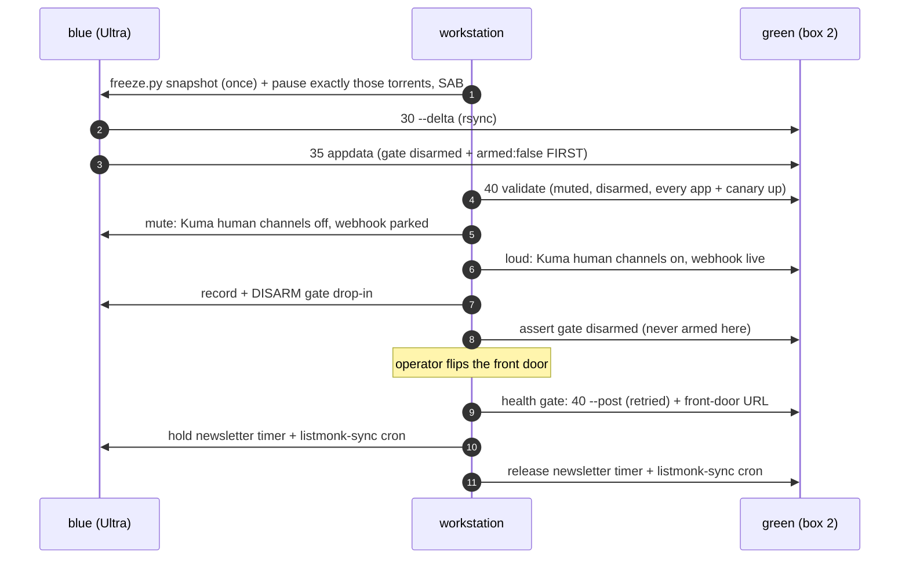

<div align="center">

# 🚚 `scripts/migrate/` — blue ➜ green, one hot swap

**Move the whole QFlix stack from the Ultra slot (blue) to box 2 (green),
with a health-gated cutover and a rollback under a minute.**


Spec: [`2026-10-09-ucc-divorce-design.md`](../../docs/superpowers/specs/2026-10-09-ucc-divorce-design.md) §8 ·
Plan: [M1 QFLX-39](../../docs/superpowers/plans/2026-10-09-ucc-divorce-plan.md)

</div>

---

> [!IMPORTANT]
> These files were **copied, never merged**, from the stale `origin/feature/migration`
> branch and re-cut on master. No script names a host and no script names an app:
> hosts are arguments, and every per-app table comes from `manifest/apps.yaml`
> through [`migrate_manifest.py`](migrate_manifest.py).

## 🗺️ The sequence

| # | File | Kind | Touches | What it does |
|:-:|---|---|---|---|
| 00 | [`00-preflight.sh`](00-preflight.sh) | 🔍 read-only | blue (+ green) | host profile, app versions via `appctl`, status summary, media sizes, timer baseline, Kuma audit, quota, task budget; green glibc / linger / PyYAML |
| 10 | [`10-provision-checklist.md`](10-provision-checklist.md) | 📋 checklist | — | what box 2 needs before any script runs |
| 15 | [`15-bootstrap-new.sh`](15-bootstrap-new.sh) | ✏️ `--execute` | green | repo + `~/scripts`, `host.profile=generic`, `host.id`, identity-secret allowlist (webhook lands **parked**) |
| 20 | [`20-install-stack.sh`](20-install-stack.sh) | ✏️ `--execute` | green | 240 + every configure phase incl. the **`3NN-native-<slug>`** installers; comms held + webhook parked after **every** phase |
| 30 | [`30-sync-media.sh`](30-sync-media.sh) | ✏️ `--execute` | blue ➜ green | `rsync -aH --partial` bulk passes, then one `--delta` pass in the freeze |
| 35 | [`35-sync-appdata.sh`](35-sync-appdata.sh) | ✏️ `--execute` | blue ➜ green | gate disarmed + roster `armed: false` **first**; `VACUUM INTO` app trees; `pg_dump` ➜ native postgres; master-era state; re-point only when needed |
| 40 | [`40-validate-green.sh`](40-validate-green.sh) | 🔍 read-only | green | every manifest app + canary, runtime-parity, gate disarmed, muted (pre) / loud (`--post`) |
| 50 | [`50-cutover.sh`](50-cutover.sh) | ✏️ `--execute` | both | 8 confirmed steps, health-gated, stops on first failure |
| 55 | [`55-rollback.sh`](55-rollback.sh) | ✏️ `--execute` | both | mute green **first**, exact-snapshot unfreeze, blue gate last |
| 60 | [`60-decommission-old.md`](60-decommission-old.md) | 📋 checklist | — | never a script |

<details>
<summary>🧰 Helpers (run locally, or ON a box fed over ssh stdin, so nothing is deployed first)</summary>

| File | Where | Job |
|---|---|---|
| [`_common.sh`](_common.sh) | sourced | args, `sshb` / `sshg`, `STAGE=` errors, window guard, I-1 / I-5 command builders |
| [`migrate.conf`](migrate.conf) | sourced | path constants, comms job keys, gate unit, state trees. No hosts, no apps |
| [`migrate_manifest.py`](migrate_manifest.py) | local | **every app table**, window answer, `evaluate-green` verdict |
| [`kuma_channels.py`](kuma_channels.py) | on a box | `status` / `mute` / `loud` for Kuma human channels (auto-heal webhook stays) |
| [`freeze.py`](freeze.py) | on blue | `snapshot` / `pause` / `resume` of exactly the active torrents + SAB |
| [`green_facts.py`](green_facts.py) | on green | read-only facts for 40 |
| [`repoint.py`](repoint.py) | on green | rewrite only blue's gateway host + collided ports in app-to-app links |

</details>

## 🧭 The contract every script keeps

```text
NN-x.sh NEW_HOST [--old-host HOST] [--execute] [--yes]
```

- **`NEW_HOST`** (green) is always the first argument. **`OLD_HOST`** (blue) is `--old-host`, or
  else what `scripts/lib/ssh.sh` resolves from the gitignored `secrets/seedbox.ssh-host`.
  The repo is public: a host literal never appears here (a test enforces it).
- **I-3:** without `--execute` a script prints its plan and makes **no ssh connection at all**.
  The one documented exception is `30-sync-media.sh`, whose dry run is a remote `rsync -n` (a read).
- **I-4:** every step is idempotent; a failed run is **re-run**, never hand-repaired.
  A dry run printed twice is byte-identical.
- **Errors:** `STAGE=<token> msg=<detail>` on stderr. **Exit** `0` ok · `1` finding / step failed ·
  `2` refused or could-not-assert (usage, unreachable, profile unresolved, inside the window).

> [!CAUTION]
> **Window guard.** Before any live run, the script asks `OLD_HOST` for its host profile
> (`hostpolicy.py preflight`, fail-closed per I-12). Profile `ultra` ➜ the window from
> `hostpolicy_ultra.py` (Mon 11:00–15:00 UTC) is evaluated locally and the run is
> **refused** inside it. Profile `generic` ➜ the box answers for its own configured window.
> An unreadable profile is a refusal, never a default.

## 📊 Tables are generated, never pasted

```console
$ python3 scripts/migrate/migrate_manifest.py apps               # name class slug was_ucc unit strategy data_dir port_secret
$ python3 scripts/migrate/migrate_manifest.py native-installers  # one 3NN-native-<slug>-install.sh per ever-UCC app
$ python3 scripts/migrate/migrate_manifest.py comms qflix-newsletter cron-listmonk-sync
```

The app **set** is always the manifest's. What the helper adds is a data **strategy** per
app, from the family table `scripts/maint/native_sanitize.py FAMILY` plus a short list of
named exceptions:

| Strategy | Apps today | Moved how |
|---|---|---|
| `sqlite-tree` | sonarr, sonarr2, radarr, radarr2, prowlarr, bazarr, bazarr2, seerr, tautulli, sabnzbd | `VACUUM INTO` each sqlite file on blue, rsync the rest; port/key/urlbase follow the data |
| `pg-dump` | postgres | `pg_dumpall --globals-only` + `pg_dump -Fc` ➜ green's native postgres, row counts compared |
| `qbit-profile` | qbittorrent | profile dirs, final pass inside the freeze |
| `state-paths` | tdarr-server, tdarr-node, victorialogs, kometa | the `STATE_TREES` in `migrate.conf` |
| `fresh-identity` | plex | **not copied** — variant P1: a new identity on box 2 (spec §7) |
| `in-postgres` / `rendered` / `stateless` | listmonk / unpackerr / the rest | nothing to move |

> [!WARNING]
> A new manifest app that fits none of these **fails the run** (`STAGE=manifest-table`, exit 2)
> and fails `tests/unit/test_migrate_manifest.py` until someone decides its strategy.
> The migration can never silently skip an app.

## 🔁 Cutover (`50-cutover.sh`)



| Invariant | Enforced in code by |
|---|---|
| **I-1** one pager, one sender | 20 holds comms + parks the webhook after every phase; 50 mutes blue **before** green goes loud and holds blue's comms **before** releasing green's; 55 mutes green **first** |
| **I-2** blue writes are a short list | freeze/unfreeze, Kuma + webhook mute, gate drop-in, comms hold — each mirrored by 55; `VACUUM INTO` targets live in `~/.cache/qflix-migrate` and are removed |
| **I-3** inert by default | plan-only without `--execute`; tests assert zero ssh/scp/rsync |
| **I-4** idempotent | snapshot and gate record written **once**; re-runs reuse them |
| **I-5** gate on ≤ 1 side | green disarmed in 35 before data lands; 50 disarms blue then only *asserts* green; arming green is the separate `--arm-green-gate`, refused until blue reads back disarmed; 55 re-arms blue only after green reads back disarmed |

> [!TIP]
> **The hashes=all gap is closed.** The stale scripts resumed `hashes=all` on rollback, waking
> torrents the operator had paused on purpose. Now step 1 records the *active* hashes to
> `secrets/migrate/freeze-snapshot.json`, and 55 resumes exactly those — or refuses.

## 🧳 Master-era state the stale branch missed

| State | Where it moves |
|---|---|
| Reaper orphan state, entitlement state, `notify.log` / ledgers, regrab + remux ledgers | `~/.opt/maint` (240-owned files excluded) |
| Reaper `permanent` tags | inside the arr DBs (`sqlite-tree`) |
| Kometa config | `~/.apps/kometa/config` |
| Tdarr DB2 (incl. flows) + configs | `~/.apps/tdarr/...`; the ffmpeg **threadcap shim** is re-applied by `50-tdarr-install.sh` in 20 and asserted by 40 |
| VictoriaLogs data | `~/.apps/vlogs/data` |
| UCC swap state | archived to `~/.opt/maint/swap.from-blue` (history; never into green's live swap dir) |

## 🔌 Contract for the `3NN-native-<slug>-install.sh` installers (A-tickets)

20 runs each installer as `SSHM_HOST=$NEW_HOST SECRETS_DIR=secrets/green QFLIX_INSTALL_MODE=fresh
bash 3NN-native-<slug>-install.sh`. In `fresh` mode an installer claims a port (`lib/ports.py`),
mints its key, writes the secrets, renders `qflix-<slug>.service` and **starts** it (spec §5.5).
20 refuses `--execute` while any installer is missing.

## 🧾 Facts worth knowing at cutover

- **Seerr vhost.** Seerr has no base path. On Ultra it is served on the `seerr-<slot>` vhost owned
  by the UCC seerr app (I-8), and `/seerr` only redirects there. Green has no such vhost: its Seerr is
  reached through green's own proxy (QFLX-41). 40 prints green Seerr's `applicationUrl` as a NOTE;
  it must match the new front door.
- **Plex P1.** Tautulli `pms_*` and Kometa's Plex URL/token still name blue's Plex after 35; the
  `tautulli-plex-link` and `kometa-libraries` canaries stay red, which blocks 40, until they are
  re-linked to green's new Plex.
- **Residual I-1 note.** Restored Tautulli notifiers / Seerr notification agents are not muted by
  these scripts; 40 prints their count. Members reach blue until the front-door flip, so green's
  Seerr sees no requests before it.
- `secrets/migrate/` (gitignored) holds the evidence: `migration-state.json`,
  `freeze-snapshot.json`, `blue-gate-dropin.conf`, optional `front-door.url`.

## 🧪 Tests

```console
$ python -m pytest tests/unit/test_migrate_scripts.py tests/unit/test_migrate_manifest.py -q
```

`test_migrate_scripts.py` drives the real scripts with fake `ssh` / `scp` / `rsync` / `curl` on
`PATH` and asserts: inert by default, identical re-run plans, window refusal before any mutating
command, manifest-driven tables, cutover stop-on-first-failure with `COMPLETED:` listing, I-1 / I-5
ordering, snapshot-once, and rollback ordering. `test_migrate_manifest.py` pins the tables, the
`evaluate-green` verdicts, the freeze snapshot, the re-point rewrite and the Kuma channel plans.
